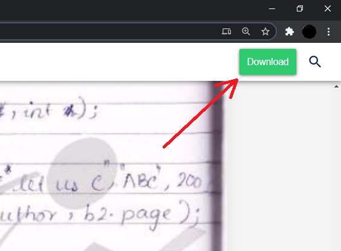
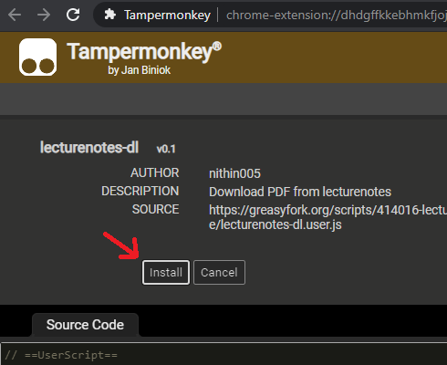

# lecturenotes-dl.tampermonkey
A TamperMonkey Script for downloading PDF from lecturenotes.in for free

    

## Steps:
1. get tampermonkey video tutorial -> https://www.tampermonkey.net/faq.php#Q100
1. go to https://greasyfork.org/en/scripts/414016-lecturenotes-dl and click "install this script" button
1. A new page opens, click the install button
 

1. the Script is now installed. 
1. Now Go to any lecturenotes.in Notes and click "read now" 
1. A download button   will appear in top right (the script injects that button into the website), click it to start download.

## For Android (Workaround):

Follow the steps carefully (this is a onetime setup)

1. Download the ungoogled chromium browser with extension support apk from here: https://uc.droidware.info/extension.html (select ARM64, rest be default option) and install it.

2. After Install, open the app, go to this url `chrome://flags/#extension-mime-request-handling` and change it to **Always prompt for install**

3. Restart the app

4. Next Install violetmonkey chrome extension (alternative to tampermonkey): https://violentmonkey.github.io/get-it/, Click the Chrome Web Store Version. Click **Add to Chrome** (button missing? check the notes below).

5. It will download a .crx extension file, then it prompts you to install it, click install.

6. Now that the extension is installed, Now get the lecturenotes downloader userscript from: https://greasyfork.org/en/scripts/414016-lecturenotes-dl, and click "install this script" button.

7. The Script is Now installed, Now go to any lecturenotes.in notes, there will be a download button visible.

   ### Note:

when you click on links in the browser, sometimes the link may open in the background, and you may need to switch the tabs manually.

If the mobile version of website doesn't work correctly, try switching to desktop mode. 

*For Example, the mobile version of chrome web store doesn't show the **Add to chrome** button, you will need to switch to desktop mode.*

### 	Common Issues:

#### lecturenotes.in website not loading?

Try clearing the website's cache then try again. 

still not working? try clearing the whole browsers cache, then follow the above steps again.

#### The PDF Download notification gets stuck?

Force Stop the app

